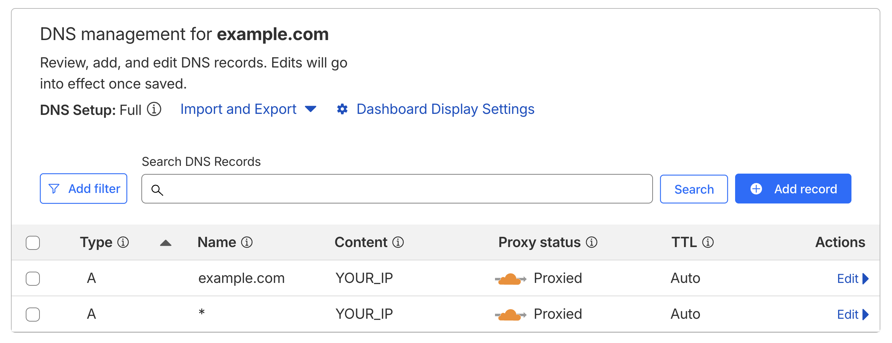

# 🤍 Sepehr VMess Proxy

Automated VMess proxy server with CloudFlare CDN support and dynamic subscriptions.

## What is this?

A simple script that sets up a VMess proxy server using Sing-Box and automatically generates subscription links with CloudFlare IP addresses for bypassing censorship.

## What you get

- Multiple VMess configs with different CloudFlare IPs
- **Uses all Cloudflare IP ranges** for maximum coverage and performance
- Auto-updating subscription (refreshes every minute)
- Random subdomains for better performance
- TLS encryption for security

## Setup

1. **Setup CloudFlare Domain:**
   - Add your domain to CloudFlare
   - Create an A record: `@` pointing to your server IP (for root domain)
   - Create an A record: `*` pointing to your server IP (for wildcard subdomains)
   - **Enable proxy (orange cloud)** on both records
   - This enables both `example.com` and `*.example.com` support with CDN protection

   

2. **Run installer:**
   ```bash
   ./install.sh
   ```

3. **Enter your domain** when prompted (e.g., `example.com`)

4. **Done!** Your subscription URL will be: `https://example.com/koje`

## How to use in V2Ray clients

1. **Copy subscription URL**: `https://example.com/koje`
2. **Add to your V2Ray client**:
   - **V2RayNG (Android)**: Settings → Subscription → Add → Paste URL
   - **Shadowrocket (iPhone)**: Home → + → Subscribe → Paste URL
   - **V2RayN (Windows)**: Subscription → Add subscription
   - **Clash (Mobile/Desktop)**: Configuration → Remote → Add → Paste URL
3. **Update subscription** to get latest servers
4. **Connect** to any of the generated servers

---

**Requirements**: Ubuntu/Debian server, domain name, root access